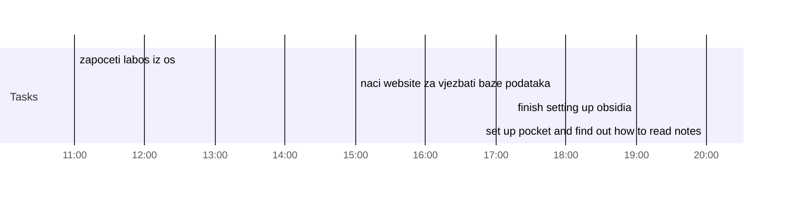

## Day Planner

## Main task
- [x] 11:00 zapoceti labos iz os

## Side quests and after lunch
- [x] 15:00 naci website za vjezbati baze podataka
- [x] 19:00 finish setting up obsidia
- [x] 20:00 set up pocket and find out how to read notes